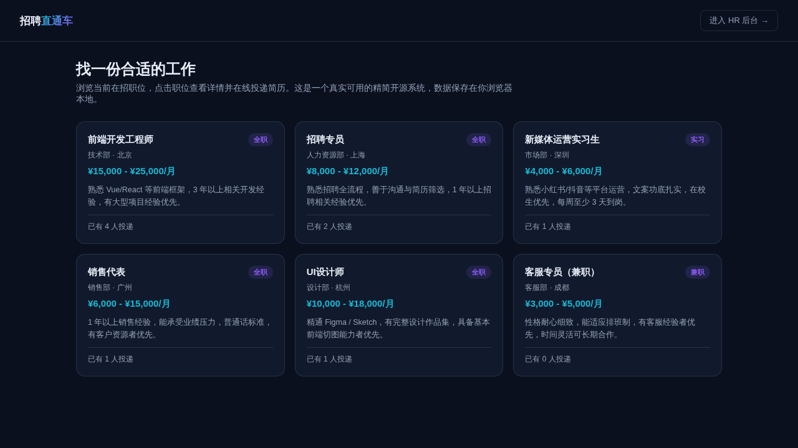

# 招聘系统（精简开源版）· Recruit Lite

**[在线体验（前台）→](https://anna123123123-creator.github.io/recruit-lite/)** · **[HR 后台 →](https://anna123123123-creator.github.io/recruit-lite/admin.html)**

免费开源的招聘系统精简版。这不是截图或原型图，是一个**真实可用**的前后台系统：职位浏览、在线投递简历、实时查看投递人数，后台职位增删改查、应聘流程流转、数据看板——都是真功能，纯前端 + `localStorage` 实现，不需要服务器、不需要数据库，克隆下来打开就能用，也适合作为学习或二次开发的起点。



## 功能

**前台（求职者视角）**
- 在招职位列表浏览（部门、城市、薪资范围、用工类型、职位要求一目了然）
- 下架/已招满的职位不会出现在前台列表
- 点开职位查看详情和已有多少人投递（真实统计，不是假数字）
- 在线提交应聘申请，自动校验姓名、手机号、简历摘要 / 自我介绍均为必填

**后台（HR 视角）**
- 仪表盘：在招职位数、简历总数、待筛选数量、本月已录用人数（实时计算），以及最新应聘记录
- 职位管理：新增、编辑、删除职位，一键上线 / 下架
- 应聘管理：按职位、按状态筛选，一键推进应聘流程（待筛选 → 面试中 → 已录用 / 已拒绝），可查看候选人完整简历摘要

## 试用方法

克隆下来，直接用浏览器打开 `index.html`，或用静态文件服务器跑起来：

```bash
python3 -m http.server 8000
```

前台在 `index.html`，后台在 `admin.html`。所有数据存在浏览器的 `localStorage` 里（`recruit_lite_data_v1` 这个 key），后台侧边栏有"重置示例数据"按钮可以随时清空重来。

## 技术说明

没有用任何框架或构建工具，纯原生 HTML/CSS/JavaScript，一共 4 个文件：`data.js`（数据层，负责 localStorage 读写和种子数据）、`index.html` + `script.js`（前台）、`admin.html` + `admin.js`（后台）。因为是纯前端 Demo，数据只存在当前浏览器里，不同设备/浏览器之间不会同步——真实生产系统需要一个后端 API 和数据库来替换 `data.js` 里的存储层，其余的界面和交互逻辑基本可以直接复用。

## 协议

MIT，随便怎么用都行。

## 需要定制版？

这个工具免费开源、可以直接用。如果你需要的是**改造成适合自己业务的版本**——换品牌、改字段、加功能、接后端或数据库——我可以做。

- **交付周期**：3–10 个工作日
- **交付内容**：完整源码（不加密、可自行二次开发）+ 在线地址 + 部署说明
- **已有 49 套现成系统**可直接改造，覆盖电商、教育、门店、内容、跨境等行业：[全部清单与在线演示](https://inzyxuashop.com)

把你的需求发给我，24 小时内回复可行性与报价：**evcdecd@gmail.com**
